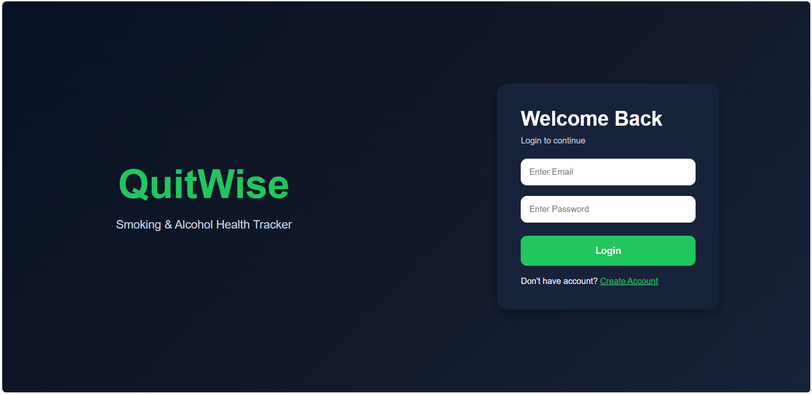
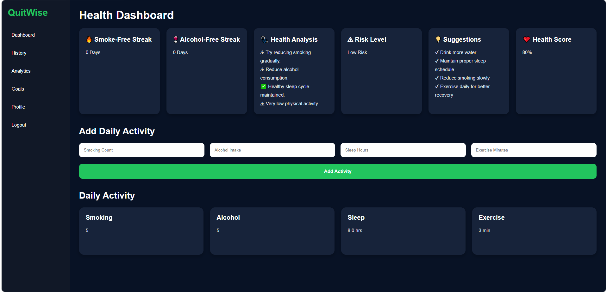
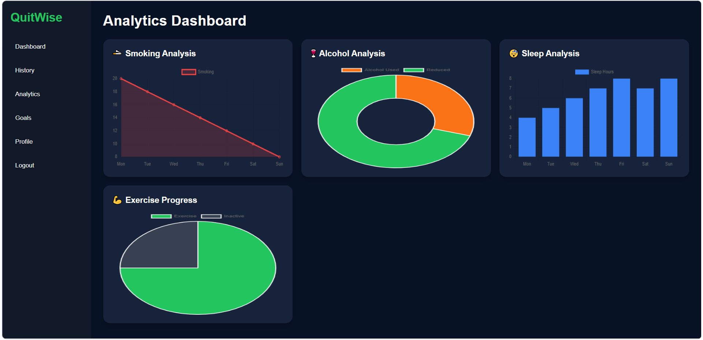
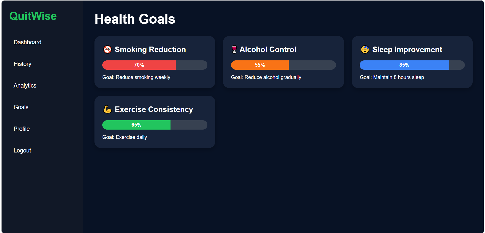
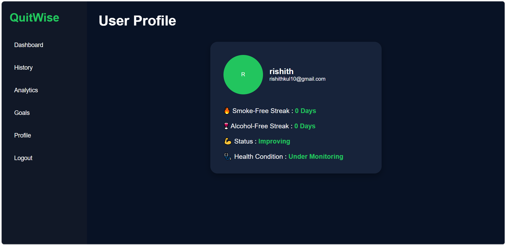

# QuitWise Health Tracker

QuitWise is a full-stack health monitoring web application developed using Flask, SQLite, HTML, CSS, and JavaScript. The application helps users track smoking habits, alcohol consumption, sleep, and exercise activities through an interactive dashboard and analytics system.

---

## Features

* User Signup & Login Authentication
* Smoking & Alcohol Habit Tracking
* Smoke-Free & Alcohol-Free Streak System
* Health Risk Analysis
* Interactive Dashboard
* Analytics Graphs
* Goal Tracking System
* Responsive UI Design

---

## Tech Stack

* Python
* Flask
* SQLite
* HTML
* CSS
* JavaScript

---

## Live Demo

https://quitwise-health-tracker.onrender.com

---

## My Contributions

* Flask backend integration
* SQLite database setup
* Authentication backend logic
* Backend connectivity with frontend
* Health tracking logic integration
* Deployment using Render

---

## Team Contributions

### Rishith Kulkarni

* Flask backend integration
* SQLite database setup
* Authentication and database connectivity
* Render deployment

### Aluwala Sharanya

* Project idea and planning
* Frontend development
* UI/UX design
* HTML/CSS/JavaScript implementation
* Dashboard layouts and interactions

---

## Project Screenshots

### Login Page

### Dashboard

### Analytics

### Goals Page

### Profile Page

## Future Improvements

* Dynamic analytics from database
* AI-based health scoring
* Advanced goal tracking
* Password encryption
* Enhanced analytics system
